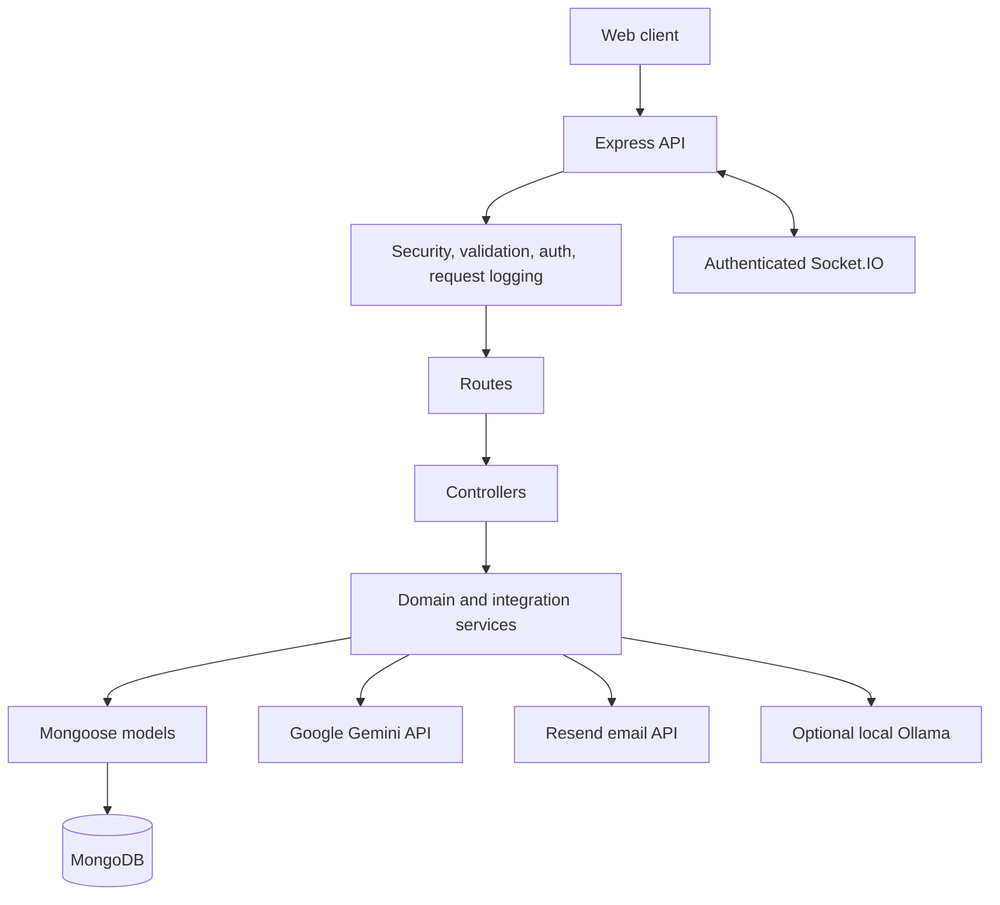

# Dental Clinic Backend

A Node.js and Express REST API for a dental clinic. It manages patient and doctor accounts, appointments, reviews, patient-doctor chat, and an AI-assisted preliminary assessment endpoint. The project uses MongoDB/Mongoose and is organized as a single deployable backend.

## Features

- Patient registration, login, Google OAuth, logout, password change, and password recovery
- Role-based access for patients, doctors, and administrators
- Doctor profiles, working hours, availability, and public rating summaries
- Appointment booking, rescheduling, cancellation, and administration
- Participant-only chat and messages, including bounded inline attachments
- Joi validation for request bodies, parameters, and supported query filters
- Gemini-powered preliminary dental assessments with validated structured output
- Optional local Ollama assistant for doctor discovery and appointment conversations
- Swagger/OpenAPI documentation for the mounted HTTP API

## Architecture



Routes apply authentication and validation before invoking controllers. Controllers handle HTTP responses; the conversational booking workflow and external Gemini/Ollama/email integrations are in services. The REST appointment controller still contains some scheduling orchestration.

## Tech Stack

- Node.js 20.19 or newer, JavaScript, Express 4
- MongoDB and Mongoose 9
- JWT, bcryptjs, Passport Google OAuth
- Joi validation
- Helmet, CORS, express-rate-limit, express-mongo-sanitize
- Socket.IO
- Google GenAI SDK, optional local Ollama via Axios, Resend
- Swagger JSDoc and Swagger UI

## Project Structure

```text
.
├── scripts/
│   └── create-admin.js
├── src/
│   ├── app.js
│   ├── config/          # Database, OAuth, Socket.IO, OpenAPI
│   ├── controllers/     # HTTP request/response handlers
│   ├── emails/          # Password reset email templates
│   ├── middleware/      # Validation and centralized errors
│   ├── models/          # User, Appointment, Chat, Message, Review
│   ├── routes/          # Versioned REST routes
│   ├── services/        # Booking, chat, doctor, Gemini, Ollama
│   ├── utils/           # Errors, async wrapper, email, API features
│   └── validation/      # Joi schemas
├── tests/
│   └── backend.test.js
├── .env.example
├── package.json
└── server.js
```

Doctors are user records with `role: "doctor"`; there is no separate Doctor collection. The frontend is a separate project and is not included here. No Docker configuration is currently provided.

## Database

The application uses these collections:

- `User`: patient, doctor, and administrator accounts, profile data, password hashes, and hidden token/reset state
- `Appointment`: patient/doctor references, time, duration, status, notes, and cancellation details
- `Chat`: one unique conversation per patient-doctor pair and unread counters
- `Message`: text and optional inline attachment metadata/data
- `Review`: one review per patient-doctor pair

Schemas use timestamps, field validation, private-field projections, and indexes for email uniqueness, appointment timelines/conflicts, chat inboxes, message history, and review summaries. User deactivation preserves references; appointment cleanup and permanent appointment deletion are admin-only.

## Authentication and Authorization

Registration creates patient accounts only. Create the initial administrator with the one-time local bootstrap command below; admins create doctor accounts. Access JWTs are short-lived by default (`15m`), refresh JWTs are rotated, and only a hash of the current refresh token is stored. Logout and password changes increment a token version to invalidate previously issued tokens.

Protected HTTP routes accept `Authorization: Bearer <access-token>` or the HttpOnly `jwt` cookie. Refresh tokens may be supplied in the request body or the HttpOnly `refreshToken` cookie. Cookie-authenticated state-changing requests require an allowed `Origin`; production cookies use `Secure` and `SameSite=None` for separately hosted frontends. Google OAuth is optional and validates a state cookie; tokens are not placed in redirect URLs.

Patients can access their own records and bookings. Doctors can access their own appointments and chats. Administrative mutations require the admin role. Resource ownership is checked in addition to authentication.

## Security and Observability

- Helmet headers, allowlisted credentialed CORS, request-body limits, and Mongo operator sanitization
- General, API, authentication, password-reset, chatbot, and AI rate limits
- Strict Joi schemas reject unknown fields; list endpoints cap page size at 100 (messages at 20)
- Passwords use bcrypt; access/refresh token types are distinguished; refresh tokens are hashed at rest
- User JSON serialization removes credentials, token/reset metadata, and login lockout state
- Public doctor and review responses use explicit projections; public reviews omit patient identifiers
- Inline chat attachments are limited to 512 KB, restricted to JPEG/PNG/WebP/PDF, and checked against file signatures
- Errors use JSON responses; production responses omit stack traces and unexpected internal details
- Request logs contain request ID, route pattern, method, status, and duration, not request bodies or patient identifiers

User-generated text is stored as plain text. Clients must render it as text or escape it before including it in HTML. Attachments are stored as bounded base64 data in MongoDB; there is no malware scanner or external object-storage integration.

## Gemini Assessment

`POST /api/v1/ai/dental-assessment` requires an authenticated user and a structured JSON body with at least `symptoms` or `clinicalFindings`. Optional fields are dental history, lab results, bounded measurements, and notes. The API does not require patient names or other direct identifiers.

The Gemini service sends the supplied clinical fields to Google using the Google GenAI SDK and `gemini-3.8-flash`. Requests time out after 30 seconds. The service asks for JSON, validates the output against a Joi schema, bounds list lengths, and returns an assessment, possible findings, abnormal results, recommendations, and a disclaimer. Invalid provider output is rejected; provider failures are returned as generic service errors.

Clinical fields are not persisted by this endpoint, but they are transmitted to Google for processing and are subject to Google's applicable terms and data handling. Do not include unnecessary identifying information. The output is an **AI-assisted preliminary assessment**, not a diagnosis, and does not replace evaluation by a qualified dental professional.

The AI route is limited to 20 requests per minute per process. `GEMINI_API_KEY` is required for provider calls.

## Other Integrations

- Password-reset email uses Resend. Set `RESEND_API_KEY` and, for production, a verified `RESEND_FROM_EMAIL`. Without email configuration, reset responses remain generic and no email is delivered.
- Google OAuth requires `GOOGLE_CLIENT_ID`, `GOOGLE_CLIENT_SECRET`, and a matching Google callback URL.
- The separate chatbot route can use local Ollama at `OLLAMA_URL`; appointment booking requires an authenticated patient and cancellation requires the appointment owner or an admin. Ollama is not required to start the API.

## API Documentation

After startup, open [http://localhost:5000/api-docs](http://localhost:5000/api-docs). The OpenAPI 3.0.3 document describes all mounted HTTP paths, authentication, parameters, request bodies, and response/error classes.

The service health endpoint is [http://localhost:5000/health](http://localhost:5000/health).

## Environment Variables

Copy `.env.example` to `.env` and replace placeholders. `.env` is ignored by Git.

| Variable                                   | Purpose                                                                                                                               |
| ------------------------------------------ | ------------------------------------------------------------------------------------------------------------------------------------- |
| `MONGO_URI`                                | MongoDB connection string; local development defaults to `mongodb://127.0.0.1:27017/dental_clinic`, production requires this variable |
| `PORT`                                     | HTTP port; defaults to `5000`                                                                                                         |
| `BACKEND_URL`                              | Public backend URL for OAuth callback and Swagger server declaration                                                                  |
| `FRONTEND_URL`                             | Frontend OAuth redirect origin; defaults to the first `CORS_ORIGIN`                                                                   |
| `CORS_ORIGIN`                              | Comma-separated allowlist of frontend origins                                                                                         |
| `NODE_ENV`                                 | Set to `production` to enable production cookie and error behavior                                                                    |
| `JWT_SECRET`                               | Access-token signing secret; required                                                                                                 |
| `JWT_SECRET_REFRESH`                       | Distinct refresh-token signing secret; required and at least 32 characters in production                                              |
| `JWT_EXPIRES_IN`                           | Access-token lifetime; defaults to `15m`                                                                                              |
| `ADMIN_EMAIL`, `ADMIN_PASSWORD`            | One-time admin bootstrap only; password must be 12-128 characters                                                                     |
| `GOOGLE_CLIENT_ID`, `GOOGLE_CLIENT_SECRET` | Optional Google OAuth credentials                                                                                                     |
| `RESEND_API_KEY`, `RESEND_FROM_EMAIL`      | Password-reset email delivery configuration                                                                                           |
| `GEMINI_API_KEY`                           | Gemini assessment integration key                                                                                                     |
| `OLLAMA_URL`, `OLLAMA_MODEL`               | Optional local Ollama endpoint and model                                                                                              |

Generate two different JWT secrets locally:

```bash
node -e "const c=require('crypto'); console.log(c.randomBytes(32).toString('hex')); console.log(c.randomBytes(32).toString('hex'))"
```

Never commit `.env` or paste real secrets into `.env.example`.

## Installation and Running

Prerequisites: Node.js `20.19+`, npm, and a reachable MongoDB instance. Start local MongoDB before starting the API.

PowerShell:

```powershell
npm install
Copy-Item .env.example .env
```

Before starting, configure `MONGO_URI`, two distinct JWT secrets, the desired CORS origin, and a running MongoDB instance. For a fresh database, set `ADMIN_EMAIL` and `ADMIN_PASSWORD`, then run this once:

```powershell
npm run seed:admin
npm run dev
```

The seed command refuses to run if an administrator already exists. For a normal production start use `npm start`; for development use `npm run dev`.

## API Examples

Patient registration (the role is assigned by the server):

```http
POST http://localhost:5000/api/v1/auth/register
Content-Type: application/json

{
  "name": "Aisha Rahman",
  "email": "aisha@example.com",
  "password": "StrongPass123"
}
```

Login:

```http
POST http://localhost:5000/api/v1/auth/login
Content-Type: application/json

{
  "email": "aisha@example.com",
  "password": "StrongPass123"
}
```

Book an appointment with a future date and an active doctor ID:

```http
POST http://localhost:5000/api/v1/appointments
Authorization: Bearer <access-token>
Content-Type: application/json

{
  "doctorId": "507f1f77bcf86cd799439011",
  "date": "2026-10-15T10:00:00.000Z",
  "duration": 30,
  "notes": "Sensitivity when chewing"
}
```

List the authenticated patient's appointments:

```http
GET http://localhost:5000/api/v1/appointments/me?page=1&limit=20
Authorization: Bearer <access-token>
```

Preliminary assessment (send the access token in the Authorization header):

```http
POST http://localhost:5000/api/v1/ai/dental-assessment
Authorization: Bearer <access-token>
Content-Type: application/json

{
  "symptoms": ["sensitivity to cold"],
  "clinicalFindings": "Localized tenderness and visible enamel wear.",
  "measurements": { "painScore": 4, "pocketDepthMm": 3 }
}
```

## Error Responses

Errors use a JSON object with `status`, `message`, and `requestId`. Validation errors include an `errors` list. Common mappings include 400 for invalid input, 401/403 for authentication or authorization, 404 for missing resources, 409 for booking conflicts/duplicates, 429 for rate limits, and 502/503/504 for external-service failures and timeouts. Development responses include a stack; production responses do not.

## Verification

The repository contains a Jest/Supertest smoke suite. Run it with `npm test` when you choose to resume testing. Other useful checks include `npm audit`, `npm start`, and JavaScript syntax checks with `node --check`.

## Known Limitations and Future Work

- Appointment conflicts are checked before writes, but concurrent requests can still race without a transactional reservation/locking strategy.
- Chat attachments are stored inline in MongoDB and are not malware-scanned; production use should move them to controlled object storage with scanning.
- Rate-limit and conversational-memory stores are per process; multi-instance deployments need shared stores.
- Persistent audit trails and clinician sign-off for AI assessments are not implemented.
- External Gemini behavior and production OAuth/email configuration depend on valid provider credentials and were not exercised here.

## License

ISC (as declared in `package.json`).
